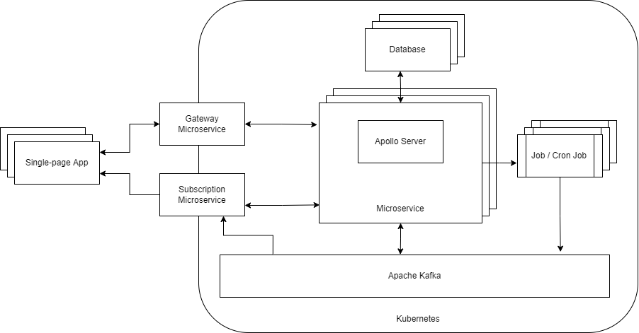

[](https://circleci.com/gh/ThinkDeepTech/thinkdeep)
[](https://sonarcloud.io/summary/new_code?id=ThinkDeepTech_thinkdeep)

# Thinkdeep
The main purpose of this repository is to learn while developing something cool. It's a bit of an experiment.

## Global Dependencies
- [Node v16.10.0](https://nodejs.org/en/)
- [Lerna v4.0.0](https://github.com/lerna/lerna)
- [Yarn v1.18.0](https://yarnpkg.com/)

## Goals
The goal started out as creation of a LitElement component collection usable in multiple web application templates. Those
templates can be used to quickly assemble web applications for potential customers. This goal has extended
into development of an application that can be used to analyze business relationships for investing purposes; a concrete
implementation of that template idea.

## Design Decisions



### The Client
The following are design decisions considered when choosing client technologies.

#### LitElement
LitElement has multiple benefits. First, it's familiar which is significant. However, it's also incredibly fast and light-weight.
When benchmarked against React it renders 30% faster for a large number of DOM nodes. LitElement came about as a result of the
Polymer project at Google which had the goal of reducing use of javascript frameworks creating custom elements. Those frameworks
are essentially needed because the browser doesn't perform it's job well enough. It's ideal to move the custom component concept into the browser itself instead
of relying on frameworks to implement that logic. Frameworks introduce additional layers which decrease performance. They prevent
reuse of custom components from one framework to the next making it difficult to migrate to a different framework as well as
requiring recreation of components that may already be available publicly (i.e, on GitHub). With adoption of custom elements support
in numerous popular browsers those frameworks are no longer needed though they're still extremely popular. It's notable
that wide-spread use of frameworks means many developers are familiar with them and, therefore, it may be difficult to find developers
who know, i.e, LitElement because it's newer. However, that may change. All of this is to say, LitElement was also chosen because it
continues that goal of using the platform giving performance gains and increasing compatibility with the current javascript ecosystem.

#### Rollup
Building the application is done using rollup because it has a clean, concise syntax. WebPack is extremely customizable but it's more
confusing to maintain. Right now, builds aren't doing anything complex so we'll see how it stands up against time in this application.

#### Testing
Mocha chai is used for front-end testing along with [open-wc testing helpers](https://open-wc.org/docs/testing/helpers/) and
[web test runner](https://modern-web.dev/docs/test-runner/overview/). The testing helpers currently have some problems waiting
for element updates as of the time of this writing. This follows from use of a relatively new ecosystem. Over time those
libraries will likely stabilize.

### The Server
The following design decisions were considered when choosing server-side technologies.

#### Apollo GraphQL
[Apollo GraphQL](https://www.apollographql.com/) provides a production-ready GraphQL implementation with some powerful features.
For a microservices architecture, our goal is to create isolated units that have a single responsibility and that can scale
independently. Apollo provides schema stitching and, more recently added, federation. I've used federation because it's viewed
as a better way of isolating microservice responsibilities. Specifically, a microservice defines its own types
but it also defines how its interface is used by other microservices. This, in theory, encapsulates all of the code relating to a given
service in one codebase. One benefit of that would be full-stack development can be done without making changes that collide
with another teams changes. Federation, as well as schema stitching, provide mechanisms for taking a subgraph and connecting
it to a full application supergraph in a seamless way. Federation uses a single gateway that provides access to the remaining
services. This gateway is the publicly accessible end-point for the microservices and routes requests to the necessary
microservice needed to gather the response. This application uses that concept because it's intended to introduce additional
microservices that will perform tasks such as data fetching/collection, data cleaning as well as providing data structures for
use in the front-end. Additional benefits include reducing the number of requests that need to go over the wire to gather data when
compared to RESTful APIs, it's backed by facebook and is used by numerous companies and is therefore battle-tested and it's fun.

#### Kubernetes
[Kubernetes](https://kubernetes.io/) is a container orchestration system with many powerful characteristics. It's used in this
project to take advantage of self-healing, monitoring, replication and load-balancing.

#### Docker
Docker provides containerization and is used for a couple of reasons. It allows developers to reproduce bugs that are seen in different
environments such as production. It encapsulates application dependencies and configuration such that each application will run
without worry about conflicting dependencies in a different application. It allows for easy backup and it takes up a much smaller
footprint than virtual machines. It's also moving toward greater adoption on multiple platforms including windows and linux.

#### Postgres
Postgres was chosen simply because I've heard good things about it and it's heavily used.

#### Testing
Mocha chai is also used in the back-end for BDD style testing. The 'expect' syntax is incredibly readable and easy to understand.
It's also desirable to use as few technologies as possible to achieve one's goals because that makes it easier for developers to
learn meaning it's easier to adopt.

### Additional Design Decisions
The following are design decisions that were not catagorizable as only client or server. Some of them are both.

#### Use of full-stack JavaScript
Reducing the mental effort needed to understand a given codebase has dramatic impacts on software development speed
and stability. Full-stack javascript was used here (along with the same testing frameworks on both front and back end)
because developers only have to learn one language as opposed to multiple.

#### Auth0 for Authentication/Authorization
Regardless of a developers experience-level implementing security-related code, it's a good idea to use a library that's
trusted by many others and that's open-source. Open-source security libraries have the advantage that more eyes can see the code
thereby increasing the likelihood that vulnerabilities will be found. Additionally, when they're found they can be fixed by
one developer that's good at security and that fix will benefit everyone using the library. Due to my lack of experience
with security-related development I opted to use one that was already available. Auth0.

## Developer Setup
- Install the dependencies mentioned above.
- Run
```console
    yarn run setup
```
- Follow the instructions for setup in each of the microservices and the analysis app.

## Environment Variables
- NODE_ENV : The environment in which the application is running (i.e, development, production)
- DIGITALOCEAN_ACCESS_TOKEN : Access token for digital ocean
- PREDECOS_MICROSERVICE_GATEWAY_URL
- PREDECOS_MICROSERVICE_SUBSCRIPTION_URL